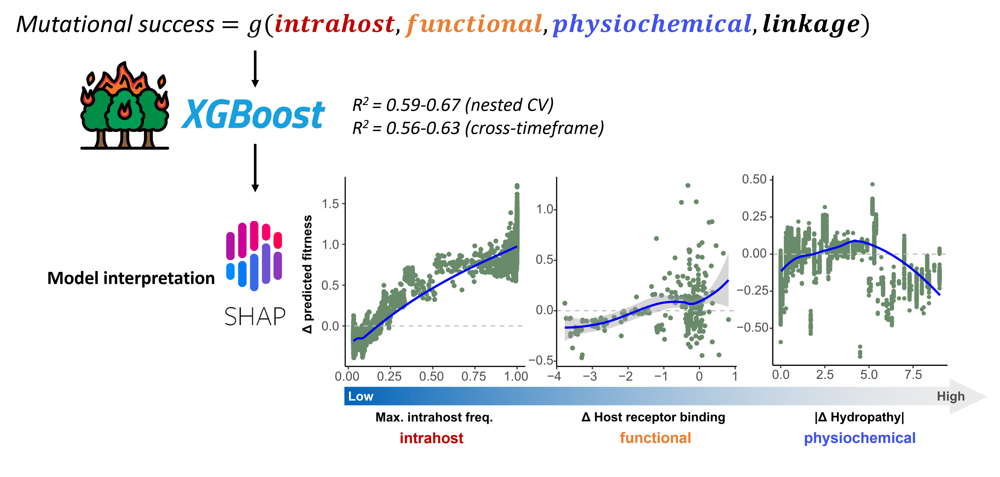

# Intrahost dynamics, together with genetic and phenotypic effects predict the success of viral mutations
Cedric CS Tan, Marina Escalera-Zamudio, Alexei Yavlinsky, Lucy van Dorp, Francois Balloux

BioRXiv: [https://doi.org/10.1101/2024.10.18.619070](https://doi.org/10.1101/2024.10.18.619070)
Source data: [Zenodo](https://doi.org/10.5281/zenodo.15255016)

# Order of scripts

## 1. Metadata parsing
### Parse BioSample metadata
[parse_ncbi_biosample_xml_to_csv.full.ipynb](download_scripts/parse_ncbi_biosample_xml_to_csv.full.ipynb)

[parse_biosample_meta.early.R](download_scripts/parse_biosample_meta.early.R)

[parse_biosample_meta.transitions.R](download_scripts/parse_biosample_meta.transitions.R)

[get_biosample_submission_date.sh](download_scripts/get_biosample_submission_date.sh)

### Parse GISAID metadata
[filter_gisaid_metadata.R](download_scripts/filter_gisaid_metadata.R)

[merge_early_and_transition_metadata.R](download_scripts/merge_early_and_transition_metadata.R)

## 2. Bioinfo pipeline
### Process samples
[consensus_pipeline.V3.transition.sbs](pipeline_scripts/consensus_pipeline.V3.transition.sbs)

### Calculate intrahost SAV frequency
[codon_freqs.sbs](pipeline_scripts/codon_freqs.sbs)

### Generate consensus
[generate_consensus_from_vcf.V2.R](pipeline_scripts/consensus_pipeline.V3.transition.sbs)

[parse_bcftools.sh # Multiallelic->biallelic VCFs](pipeline_scripts/parse_bcftools.sh)

### Remove gappy sequences
[merge_and_filter_alignment.R](qc_scripts/merge_and_filter_alignment.R)

### Pangolin lineage assignment
[pangolin.sh](qc_scripts/pangolin.sh)

### Remove misassigned genomes and SNP count outliers
[calculate_snp_distances.R](qc_scripts/calculate_snp_distances.R)

[pango_filter.R](qc_scripts/pango_filter.R)

## 3. GISAID data
### Calculate monthly SAV frequencies
Split by region: [calculate_monthly_frequencies.geo.crick.R](gisaid_scripts/calculate_monthly_frequencies.geo.crick.R) 

All time: [calculate_monthly_frequencies.V2.crick.R](gisaid_scripts/calculate_monthly_frequencies.V2.crick.R) 

### Aggregate SAV fitness
For each timeframe: [aggregate_monthly_prop.R](gisaid_scripts/aggregate_monthly_prop.R) 

For each cross-dataset timeframe [aggregate_monthly_prop.cross_dataset.R](gisaid_scripts/parse_ncbi_biosample_xml_to_csv.full.ipynb)

Across all time: [aggregate_monthly_prop.all_time.R](gisaid_scripts/aggregate_monthly_prop.all_time.R)

## 4. Linkage
### Generate presence absence matrix of mutations for D' calculations
[split_gisaid_by_month.R](gisaid_scripts/split_gisaid_by_month.R)

[generate_presence_matrix.V2.crick.R](gisaid_scripts/generate_presence_matrix.V2.crick.R)

[submit_generate.crick.sbs](gisaid_scripts/submit_generate.crick.sbs)

### Calculate D' (interhost linkage)
Before each timeframe: [calculate_Dprime.before.parallel.V2.crick.R](linkage_scripts/calculate_Dprime.before.parallel.V2.crick.R)

After each timeframe: [calculate_Dprime.after.parallel.V2.crick.R](linkage_scripts/calculate_Dprime.after.parallel.V2.crick.R)

Across all time: [calculate_Dprime.before.parallel.V2.crick.R](linkage_scripts/calculate_Dprime.all_time.parallel.V2.crick.R)

[submit_Dprime.crick.sbs](linkage_scripts/submit_Dprime.crick.sbs)

### Intrahost linkage
[calculate_allele_correlation.V2.with_zeroes.all.R](linkage_scripts/calculate_allele_correlation.V2.with_zeroes.all.R)

## 5. Machine learning models
### Generate datasets for models
[generate_mutation_stats.all.R](intrahost_scripts/generate_mutation_stats.all.R)

[generate_mutation_stats.cross_country.R](intrahost_scripts/generate_mutation_stats.cross_country.R)

[generate_mutation_stats.cross_dataset.R](intrahost_scripts/generate_mutation_stats.cross_dataset.R)

[generate_mutation_stats.all.R](intrahost_scripts/generate_mutation_stats.all.R)

[add_Dprime_stats.R](intrahost_scripts/add_Dprime_stats.R)

[add_Dprime_stats.cross_dataset.R](intrahost_scripts/add_Dprime_stats.cross_dataset.R)

### Nested-CV
Physiochemical+phenotypic+intrahost predictors: [regression.transition.py](ML_scripts/regression.transition.py)

Physiochemical+phenotypic+intrahost+partition+linkage predictors: [regression.transition.partition.dprime_only.py](ML_scripts/regression.transition.partition.dprime_only.py)

Physiochemical+phenotypic+intrahost predictors (Spike SAVs only): [regression.transition.spike.py](ML_scripts/regression.transition.spike.py)

### Cross-dataset CV
Physiochemical+phenotypic+intrahost predictors: [regression.cross_dataset.py](ML_scripts/regression.cross_dataset.py)

Physiochemical+phenotypic+intrahost+partition+linkage predictors: [regression.transition.partition.dprime_only.py](ML_scripts/regression.cross_dataset.partition.dprime_only.py)

Physiochemical+phenotypic+intrahost predictors (Spike SAVs only): [regression.cross_dataset.spike.py](ML_scripts/regression.cross_dataset.spike.py)

## 6. Model evaluation
Single-timeframe Nested CV results: [visualise_ML_results.all.R](ML_scripts/visualise_ML_results.all.R)

Cross-country results: [cross_country_results.R](ML_scripts/cross_country_results.R)

Model performance with or without intrahost predictors: [intrahost_vs_no_intrahost.R](ML_scripts/intrahost_vs_no_intrahost.R)

Model performance with or without linkage predictors: [linkage_vs_no_linkage.R](ML_scripts/linkage_vs_no_linkage.R)

Model performance with or without linkage predictors (cross-dataset): [linkage_vs_no_linkage.cross_dataset.R](ML_scripts/linkage_vs_no_linkage.cross_dataset.R)

Model performance when using different fitness estimates: [num_genomes_vs_max_prop.R](ML_scripts/num_genomes_vs_max_prop.R)

## 7. SHAP and mutation subset analysis
Relationships between predictors and response: [visualise_predictor_relationships.R](ML_scripts/visualise_predictor_relationships.R)

Relative importance of predictors: [visualise_relative_importance.R](ML_scripts/visualise_relative_importance.R)

Relative importance of predictors in RBD vs. non-RBD: [RBD_vs_nonRBD.importance.R](prediction_scripts/RBD_vs_nonRBD.importance.R)

Relative importance of predictors aggregated by predictor types: [sum_shap_effect.all.R](prediction_scripts/sum_shap_effect.all.R)

Prediction errors for observed and unobserved SAVs: [observed_vs_unobserved.R](prediction_scripts/observed_vs_unobserved.R)

Prediction errors stratified by protein: [errors_vs_protein.R](prediction_scripts/errors_vs_protein.R)

Prediction errors for fit and non-fit SAVs: [fit_vs_non_fit.R](prediction_scripts/fit_vs_non_fit.R)

Prediction errors stratified by spike or non-spike SAVs: [spike_vs_non_spike.R](prediction_scripts/spike_vs_non_spike.R)

Prediction errors stratified by spike or non-spike SAVs (cross-dataset): [spike_vs_non_spike.cross_dataset.R](prediction_scripts/spike_vs_non_spike.cross_dataset.R)

